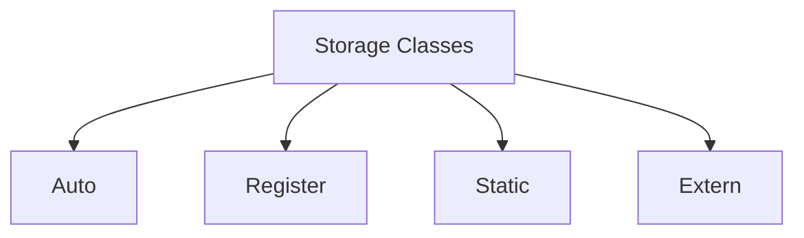

___
# Basics of C Programming
## Sample Code

```c
# include<stdio.h>
main()
{
	printf("Hello World");
}
```

`include<stdio.h>`
- Its a header
- standard input output header file
	`printf`
	`scanf`


> [!NOTE] What is f in printf?
> **It is called formatted print. It allows `\n, \t` etc.**

---
##   Precedence & Associativity of All Operators

| Group              | Operator                                                 | Category                                                                                       | Associativity     | Precedence |
| ------------------ | -------------------------------------------------------- | ---------------------------------------------------------------------------------------------- | ----------------- | ---------- |
| **Parenthesis**    | `()` `[]` `->` `.`                                       | Function call, Array subscript, Arrow, Dot                                                     | Left to right     | Highest 14 |
| ==**Unary**==      | `++` `--` `!` `~` `(type)` `&` `*` `sizeof`              | ==Increment, Decrement, Logical NOT, One's complement, Cast, Address of, Indirection, Sizeof== | ==Right to left== | ==13==     |
| **Multiplicative** | `*` `/` `%`                                              | Multiplication, Division, Modulus                                                              | Left to right     | 12         |
| **Additive**       | `+` `-`                                                  | Addition, Subtraction                                                                          | Right to left     | 11         |
| **Shift**          | `<<` `>>`                                                | Left Shift, Right Shift                                                                        | Left to right     | 10         |
| **Relational**     | `<` `<=` `>` `>=`                                        | Less than, Less than or Equal to, Greater than, Greater than or Equal to                       | Left to right     | 8          |
| **Equal To**       | `==` `!=`                                                | Equal to, Not equal to                                                                         | Right to left     | 8          |
| **Bitwise AND**    | `&`                                                      | Bitwise AND                                                                                    | Left to right     | 7          |
| **Bitwise XOR**    | `^`                                                      | Bitwise XOR                                                                                    | Left to right     | 6          |
| **Bitwise OR**     | `\|`                                                     | Bitwise OR                                                                                     | Right to left     | 5          |
| **Logical AND**    | `&&`                                                     | Logical AND                                                                                    | Left to right     | 4          |
| **Logical OR**     | `\|\|`                                                   | Logical OR                                                                                     | Left to right     | 3          |
| ==**Ternary**==    | `? :`==                                                  | ==Conditional==                                                                                | ==Right to left== | ==2==      |
| ==**Assignment**== | `=` `+=` `-=` `*=` `/=` `%=` `>>=` `<<=` `&=` `^=` `\|=` | ==Assignment operators==                                                                       | ==Right to left== | ==1==      |
| **Comma**          | `,`                                                      | Comma                                                                                          | Left to right     | Lowest 0   |


![[precendance_associativity.png]]


> [!NOTE] Associativity
> **Check Highlighted Ones: Unary, Ternary and Assignment.** TAU is always Right

---
### Arithmetic Operators

| Operation  | Sign | Code                                                   |
| ---------- | ---- | ------------------------------------------------------ |
| Sum        | `+`  | `x+y`                                                  |
| Difference | `-`  | `x-y`                                                  |
| Product    | `*`  | `x*y`                                                  |
| Quotient   | `/`  | `x/y` (ignores no. after point eg: 2.52. will print 2) |
| Remainder  | `%`  | `x%y`                                                  |
##### Integer

```c
int main() 
{
	int x = 6, y = 5;
	printf("Sum = %d\n",x + y); // 11
	printf("Difference = %d\n",x - y); // 1
	printf("Product = %d\n",x * y); // 30
	printf("Quotient = %d\n",x / y); // 1 (1.2 not possible)
	printf("Remainder = %d\n",x % y); // 1
	return 0;
}
```

##### Float
``` c
int main() 
{
	float x = 5.8, y = 2.3;
	printf("Sum = %f\n",x + y); // 8.1
	printf("Difference = %f\n",x - y); // 3.5
	printf("Product = %f\n",x * y); // 13.34
	printf("Quotient = %.3f\n",x / y); // 2.521
	// Remainder x % y does not exist
}
```

> [!NOTE] Never do %f in Int/Int
> The result will be invalid
#### Increment and Decrement Operator

`a = 5`

| Operator            | Internal Working   | Final Answer                 |
| ------------------- | ------------------ | ---------------------------- |
| `printf("%d",a);`   |                    | 5                            |
| `printf("%d",++a);` | a = a+1<br>Use a   | 6                            |
| `printf("%d",--a);` | a = a - 1<br>Use a | 4                            |
| `printf("%d",a++);` | Use a<br>a = a + 1 | 5<br>// internally a = 6 now |
| `printf("%d",a--);` | Use a<br>a = a - 1 | 5<br>// internally a = 4 now |
#### Comma Operator

1. Separator
2. Operator

``` c
int main()
{
	int a, b;
	a = (2, 3, 4); // Operator (Ans: 4)
	b = 2, 3, 4; // Seperator (Ans: 2)
	printf("%d, %d", a, b); // 4, 2
	return 0;
}
```

#### Ternary Operator

`___ ? ___ : ____`

``` c
int main()
{
	int x, y, max;
	scanf("%d%d", &x, &y);
	max = x>y ? x : y
	printf("Max = %d\n",max);
	return 0;
}
```

`max = x>y ? x : y`

if (x > y)
	True: x
	False: y

`z = (x == 3 ? (y == 4 ? 6 : 8) : 0);`

if (x == 3)
	True: if (y == 4)
		True: 6
		False: 8
	False: 0

#### Sizeof Operator 

**No. of bytes required to store**

> [!NOTE] Is Sizeof a function in C?
> No, Sizeof is not a function, Its an Operator.

| Data Type               | Bytes |
| ----------------------- | ----- |
| `int x;`<br>`sizeof(x)` | 4     |
| `sizeof(int)`           | 4     |
| `sizeof(5)`             | 4     |
| `sizeof(char)`          | 1     |
| `sizeof(short int)`     | 2     |
| `sizeof(float)`         | 4     |
| `sizeof(double)`        | 8     |
| `sizeof(long double)`   | 16    |

#### TypeCasting

**Types**
1. **Implicit Typecasting**
	- Done by compiler
	- No loss of information
	- Eg: x (8 bit) + y (16 bit) = Ans (Automatically converts x into 16 bit)
2. **Explicit Typecasting**
	- Done by programmer
	- Will be loss of information
	- Eg: float x; int(x)

**Important Case**

**Case 1:**

`int a = 10, b = 3;`
`float c = a / b;`
Ans:  3.0 (not 3.3333)

**Case 2: Precedence**

`int a = 10, b = 3;`
`float c = (float)a/b;` //  float a / int b 
Ans: 3.33333

**Case 3: Associativity**

`int a = 10, b = 3;`
`float c = (float)(a/b)` // first will solve a/b R -> L
Ans: 3.0
____
# Control Statements

### If Else Statements
``` c
int main()
{
	int n1=1, n2=2;
	if(n1 > n2) 
	{
		printf("%d", n1)
	}
	else 
	{
		printf("%d", n2)
	}
}
```

``` c
enum Fruit { Apple, Mango };

int main()
{
    int n = Mango;
    if (n == Apple)
    {
        printf("Apple");
    }
    else if (n == Mango)
    {
        printf("Mango");
    }
    else
    {
        printf("Not a fruit");
    }

    return 0;
}

```


> [!NOTE] Can you write without Else or Else Ifs?
> Yes, I can consecutively write multiple Ifs and skip Else
### While Loop

``` c
int main()
{
	int n = 1;
	while(n <= 5)
	{
		printf("%d", n); // 1 2 3 4 5
		n = n + 1;
	}
}
```

``` c
int main()
{
	int n = 1;
	while(n <= 5)
	{
		n = n + 1;
	}
	printf("%d", n); // 6
}
```

### Do While Loop

The body of the loop is executed atleast once before the test expression is evaluated.

``` c
int main()
{
	int n = 1;
	do
	{
		printf("%d", n); // 1 2 3 4 5  
		n = n + 1; // 2 3 4 5 6
	}
	while(n <= 5)
}
```

____
### Break and Continue

| Statement  | What it does?                                               |
| ---------- | ----------------------------------------------------------- |
| `break`    | Immediately exits the loop                                  |
| `continue` | Skips the current iteration and moves to the next iteration |

``` c
int main()
{
	for(int i = 1; i <= 6; i++)
	{
		if(i == 5)
		{
			break;
		}
		printf("%d", i); // 1 2 3 4
	}
	return 0;
}
```

When `i` becomes `5`, `break` stops the loop completely.

``` c
int main()
{
	for(int i = 1; i <= 6; i++)
	{
		if(i == 3)
		{
			continue;
		}
		printf("%d", i); // 1 2 4 5 6
	}
	return 0;
}
```

- When `i` is `3`, `continue` skips that iteration only.
- The loop continues with `4` ,`5` and `6`.
___
## Storage Classes

- Datatype
- Storage Class
- Memory
- Scope
- Lifetime



### Auto
- it is the default storage class `int a;` -> `auto int a;`
- by default value = garbage value (not 0)
- by default stored in RAM

> **Register faster than RAM**
> **if we calling a variable again and again, we prefer Registers**

**Lifetime**
- lifetime completes when the block of code where it is initialized is over
- if called again and again,
	- gets reinitiated again and again
	- new address is allocated again and again
- if called in another function, will give "undefined error"
- if initialized multiple times, it picks up value from the nearest scope.

**Scope** 
the block of code

### ==Static==
- default value = 0
- by default stored in RAM

**Lifetime**
- never gets reinitialized
- lifetime completes when Main program completes
- if called in another function, will give "undefined error"

**Scope**
the block of code

## ~~Static and Dynamic Scoping~~

---
# Pointers

``` c
int x = 10; // stored in address 1000
int *y = &x; // y = 1000 
printf("%d", x); // 10
printf("%u", &x); // 10000; u = unsigned (always +ve value)
printf("%u", y); // 1000; using u because it is a pointer variable
printf("%d", *y); // 10; using d becuase it goes inside the address to extract the value
printf("%u", &y); // 2000 
```

### Dangling Pointer

points to
- unallocated memory // error is "Unsegmented Fault"
- out of scope memory 

### Generic Pointer
- can store address of any data type

**Little Endian Method**

```text
LSB -> Lower Address -> Least Significant Bit
MSB -> Higher Address -> Most Significant Bit
```

```c
short int a = 14;
```

`short int` usually takes 2 bytes.

Binary form of 14:

```text
1110
```

| Byte | Value |
| ---- | ----- |
| MSB  | `11`  |
| LSB  | `10`  |

| Address | Stored Value |
| ------- | ------------ |
| 1000    | LSB (`10`)   |
| 1004    | MSB (`11`)   |
> **Big Endian Method** : EXACT OPPOSITE OF THIS

1. **Wild Pointer**
	- value not declared, therefore, garbage value assigned
	- Eg: `int *ptr;` // 3247893 = garbage value
2. **Null Pointer**
	- value declared `NULL`(Micro constant) or `0`
	- `int *ptr=0;`printf("%u", *ptr);` // will give segmentation fault

---
# Declaration Examples

|Declaration|Meaning|
|---|---|
|`int a[5]`|`a` is an array of 5 integers.|
|`int *p[5]`|`p` is an array of 5 pointers to integers.|
|`int (*p)[10]`|`p` is a pointer to an array of 10 integers.|
|`char **a`|`a` is a pointer to a pointer to `char`.|
|`char *c()`|`c` is a function returning a pointer to `char`.|
|`char (*c)()`|`c` is a pointer to a function returning `char`.|
|`char (*(*c())[])()`|`c` is a function returning a pointer to an array of pointers to functions returning `char`.|
|`char (*(*c[5])())[6]`|`c` is an array of 5 pointers to functions returning pointers to arrays of 6 characters.|

## Notes

- Parentheses `()` are important in C declarations because they control precedence.
    
- `[]` has higher precedence than `*`, so parentheses are often required when declaring pointers to arrays or pointers to functions.
    
- Function declarations such as `char *c()` and `char (*c)()` have very different meanings because of the placement of parentheses.

---
## Functions


> **A reusable piece of code that performs a specific task.**
> **called Modules or Procedures**

- Reusability
- Debuggable
- Clean code

``` c
#include <stdio.h>
int add(int x, int y)
{
	return x + y;
}

int main()
{
	int result = add(5, 3)
	printf("Sum = %d", result);
	return 0;
}
```

### Parts of Function

1. **Function Declaration**
	- intro for our function
	- `int add(int, int);`

2. **Function Definition**
	- actual code
	- `int add(int a, int b)`  
		`{`  
		`return a + b;`  
		`}`
		
3. **Function Call**
	- Used to execute the function.
	- `add(5, 3);`
### Types of Function

**Built-in functions provided by C.**

Eg:
- `printf()`
- `scanf()`
- `strlen()`

### 2. User-defined Functions

**Functions created by the programmer.**

Eg:
``` c
int multiply(int a, int b)
{    
	return a * b;
}
```

